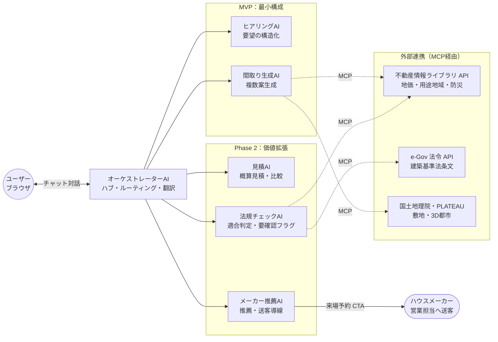
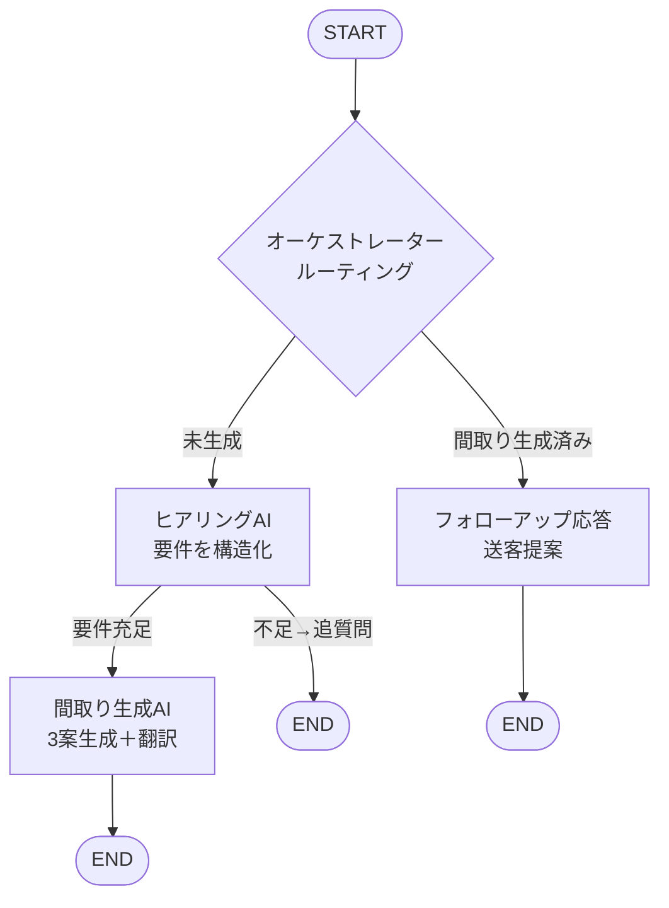

# スマイエージェント 要件定義書

| 項目 | 内容 |
|---|---|
| 文書名 | スマイエージェント 要件定義書 |
| バージョン | 1.0（統合版） |
| 作成日 | 2026-07-14 |
| ステータス | チーム統合ドラフト（レビュー前） |
| 対象フェーズ | MVP（Demo）を中心に定義し、Phase 2・3 を拡張前提として整理 |

> **本書の位置づけ**：調査チーム検討状況（2026年6月9日）・ZW案・KH案・YY案・housing-agent-ontology の各資料を統合し、チームとして共有できる形にまとめたものである。最終方針の決定はチーム協議を経て確定する。

---

## 目次

1. 背景・目的
2. サービスコンセプト・差別化
3. 収益モデル
4. 対象ユーザー（ペルソナ）
5. ユーザー導線・ユースケース
6. システム全体アーキテクチャ（マルチエージェント）
7. 機能要件
8. データモデル
9. 外部インターフェース
10. UI / UX 要件
11. 非機能要件
12. デモ・モック固有の制約
13. 受入基準
14. リスクと対応
15. 未決事項
16. 用語定義

---

## 1. 背景・目的

### 1.1 現状の課題

注文住宅の初期検討フェーズでは、購入意欲の高いユーザーが自らハウスメーカーを訪れ、担当者と**数か月かけて**初期プランを作成している。工程は以下の 6 段階：

1. ヒアリング（要件整理）
2. 初期プラン作成（間取り）
3. 概算見積
4. 法規チェック
5. 商談
6. 詳細設計〜建築

①〜④の初期検討に多大な時間がかかり、ユーザー・ハウスメーカー双方の負担が大きい。また、個人が中立的な立場から複数社を比較する手段がなく、営業担当の信頼性に依存した意思決定を強いられている。

### 1.2 スマイエージェントが目指す姿

ユーザーの要望から **AI がリアルタイムに初期プラン（①〜④）を作成**し、ハウスメーカーへの送客・来場誘導まで行う。AI は「来場予約（送客）まで」を担い、そこから先（⑤商談・⑥詳細設計〜建築）は人間の営業担当にバトンタッチする。

**「質問に答えるだけで家ができる」体験** を提供し、設計知識不要な UX を実現する。

### 1.3 プロジェクト目標成果物（優先順）

本プロジェクトのゴールは本番サービスではなく、以下 3 点の成立である。

1. **パワポ紹介スライド** … 住宅業界のビジネスが本アプリ導入でどう変わるか before/after（**最重要**）
2. **デモ動画**
3. **モックアプリ** … デモを最低限動かせる程度

> 【critical】本書の要件はすべて「上記 3 成果物に寄与するか」で優先度判定する。デモに映らない機能は原則 Could 以下。

---

## 2. サービスコンセプト・差別化

### 2.1 価値提案

| 価値軸 | 説明 |
|---|---|
| 速さ | 入力完了後、MVP 標準条件で初回提案を短時間で生成 |
| 反復性 | 条件を変更しながら履歴を保持したまま再生成できる |
| 中立性 | ハウスメーカー非依存・営業バイアスなし。推薦ロジックを透明化 |
| 比較可能性 | 複数案を同一尺度（費用・面積・動線・法規注意・送客候補）で比較 |
| 説明可能性 | 出力ごとに前提・根拠・推定範囲・未確認事項を表示 |
| 送客価値 | 要件整理済みプランをハウスメーカーへ持ち込むことで商談の質を向上 |

### 2.2 既存サービスとの差別化

| 軸 | 既存サービス | スマイエージェント |
|---|---|---|
| 間取り生成 | あり（ビジュアル重視・実務制約弱） | 建築基準連携あり |
| 見積 | 人依存 | AI 生成（概算） |
| 法規チェック | なし | 自動チェック（要確認フラグ付き） |
| 比較 | 住宅メーカー比較 | プラン比較 ＋ 送客 |
| 導線 | 問い合わせ止まり | AI 対話 → プラン生成 → ハウスメーカーへ送客 |

> **一気通貫の差別化**：「①AI 間取り生成＋②概算見積＋③建築基準法チェック」を日本語で提供する空白地帯を埋める。

---

## 3. 収益モデル

本サービスのビジネスモデルは **サプライヤー（ハウスメーカー・工務店）課金**を基本とする。ユーザーへの直接課金は MVP ではスコープ外とする。

### 3.1 基本収益構造

| モデル | 内容 | 優先度 |
|---|---|---|
| **送客課金（成果報酬型）** | AI を通じてヒアリング・プラン生成を経た見込み顧客をハウスメーカーへ送客し、来場予約・商談成立に応じて課金する | **MVP** |
| **掲載・推薦枠課金** | 推薦結果への優先掲載費。中立性との両立のため掲載関係を必ず開示する | Phase 2 |
| **データ提供・分析** | 匿名化した住宅需要トレンドデータのサプライヤーへの提供 | Phase 3 |

### 3.2 ユーザーへの課金方針（MVP）

- **ユーザーへの直接課金機能は MVP では実装しない**
- ユーザー作成・個人情報登録はデモ用のサンプルデータのみ用意し、本番の会員管理機能は実装しない
- 将来的な有料プラン（機能制限・回数制限等）を想定した権限モデルのみ設計上定義する（コードに価格・回数をハードコードしない）

---

## 4. 対象ユーザー（ペルソナ）

調査チーム検討状況（2026年6月9日）に基づく。

| 項目 | **A：初めて検討層**（主ペルソナ） | B：建替え・住替え層 | C：土地ありこだわり層 |
|---|---|---|---|
| 年齢 | 30〜35歳 | 45〜55歳 | 35〜45歳 |
| 家族構成 | 夫婦＋子1（未就学） | 夫婦＋子2（高校・大学） | 夫婦＋子1〜2、親同居検討 |
| 世帯年収 | 600〜900万円 | 900〜1,400万円 | 700〜1,200万円 |
| 検討段階 | 何から始めるか不明、展示場訪問前 | 老朽化／二世帯への建替え | 相続した土地で自由設計を希望 |
| 行動特性 | スマホ中心、SUUMO/HOMES で収集 | 複数 HM の相見積もり前提 | 設計事務所も視野、自分で要件整理 |
| 共通の痛み | どの住宅会社が良いかわからない、価格相場がわからない、間取りの良し悪しがわからない、住宅会社の営業を信用してよいかわからない、住宅展示場を回る時間がない | ← 同左 | ← 同左 |
| 本サービスへの期待 | 予算と条件で間取り＋総額をすぐ見たい | 営業前の比較検討の叩き台 | 建築基準法的に成立するか確認したい |
| MVP 優先度 | **最優先** | 次点 | 次点 |

> A 層（展示場訪問前）が最も市場ボリュームが大きく、before/after スライドの訴求も分かりやすいため主ペルソナとする。

---

## 5. ユーザー導線・ユースケース

### 5.1 標準ユーザー導線（マルチエージェント経由）

ユーザーはブラウザ（ローカルビルド）上のチャット UI から**オーケストレーターAI**とのみ対話する。オーケストレーターが各専門エージェントにタスクを振り分け、結果を翻訳してユーザーに返す。最終的にハウスメーカーへの送客（来場予約 CTA）まで到達することを目指す。

```
① ユーザー: ブラウザ上のチャット画面でオーケストレーターAI に話しかける
         │
② オーケストレーターAI: ヒアリングAI に要件整理を依頼
         │
③ ヒアリングAI: 不足情報を能動的に聞き返し、住宅要件書（構造化オブジェクト）を作成
         │
④ オーケストレーターAI: 要件充足を確認 → 間取り生成AI へ
         │
⑤ 間取り生成AI: コンセプトの異なる複数案（最低3案）を生成・提示
         │
⑥ （Phase 2）見積AI: 概算見積を生成・比較表を提示
         │
⑦ （Phase 2）メーカー推薦AI: ハウスメーカーを推薦、来場予約 CTA を提示
         │
⑧ ユーザー → ハウスメーカーへ送客（商談・契約は人間の営業担当へバトンタッチ）
```

### 5.2 デモシナリオ（要調査チーム協議）

デモで使用するシナリオは以下の項目を協議のうえ確定する（詳細は §15 未決事項 U-01）。

- 主ペルソナの選択（推奨: A 層）
- 土地の有無
- デモの起点（初回入力）と終点（何が出たらデモ終了か）
- 見せ場の順序（ヒアリング → 間取り生成 → 推薦・送客）

---

## 6. システム全体アーキテクチャ（マルチエージェント）

### 6.1 エージェント一覧と優先度

| # | エージェント | 役割 | 優先度 | フェーズ |
|---|---|---|---|---|
| ① | **オーケストレーターAI** | 全エージェントのハブ。会話を解釈しタスクを振り分け、結果を翻訳して返す | **必須** | MVP |
| ② | **ヒアリングAI** | 要望の深掘り・構造化。「設計に渡せる要件定義」を作成 | **必須** | MVP |
| ③ | **間取り生成AI** | 要件＋条件から間取り案を複数生成。アウトプットとして視覚的に分かりやすい | **必須に近い** | MVP |
| ④ | 見積AI | 間取り＋仕様レベルから概算見積を生成。難易度が高いため優先度低 | 低 | Phase 2 |
| ⑤ | 法規チェックAI | 外部 API 連携で法規適合を判定し要確認項目をフラグ化。優先度低＋α | 低 | Phase 2/3 |
| ⑥ | メーカー推薦AI | ハウスメーカーを推薦・理由を言語化・来場予約導線を作る。デモで見せられると強い | デモ目玉候補 | Phase 2 |

### 6.2 アーキテクチャ図（全体・目標像）



### 6.3 MVP 処理フロー図



### 6.4 技術スタック（方針）

| 領域 | 方針 |
|---|---|
| オーケストレーション | LangGraph（`StateGraph` / `add_messages` / `MemorySaver`） |
| 言語 | Python 3.10+ |
| LLM | Claude（Anthropic）／LLM Provider Adapter を設け交換可能にする |
| API サーバー | FastAPI + Uvicorn |
| スキーマ検証 | Pydantic v2（`with_structured_output` による構造化抽出） |
| 会話永続化 | インメモリ `MemorySaver`（MVP）。DB 化は Phase 2 以降 |
| インターフェース | **ローカルでビルドしブラウザで表示**（単一 HTML または軽量 SPA）|
| 外部連携 | MCP 経由。既製 MCP サーバー優先、自作は最後の手段 |

---

## 7. 機能要件

優先度: **Must**（デモ成立に必要）／**Should**（デモの説得力を上げる）／**Could**（余力があれば）

### 7.1 オーケストレーターAI

| ID | 要件 | 優先度 |
|---|---|---|
| ORC-1 | ユーザーの発話を受け取り、状態（要件充足度・間取り生成有無）に応じて次エージェントへルーティングする | Must |
| ORC-2 | 要件が未充足なら「ヒアリングAI」へ、充足かつ間取り未生成なら「間取り生成AI」へ振り分ける | Must |
| ORC-3 | 間取り提示後の追加質問・感想には一般応答し、必要に応じてハウスメーカー相談・送客を提案する | Must |
| ORC-4 | 各エージェントの構造化結果を、ユーザー向けの自然な日本語に翻訳して返す | Must |
| ORC-5 | タスクごとに一意の Session ID を付与し、複数ターンで会話を継続する | Must |

### 7.2 ヒアリングAI

| ID | 要件 | 優先度 |
|---|---|---|
| HEAR-1 | チャットで自然言語の要望を深掘りする | Must |
| HEAR-2 | 会話全体から要望を構造化（住宅要件書）する。読み取れない項目は推測で埋めない | Must |
| HEAR-3 | 「家族構成・予算・土地情報・希望の広さ」が揃った場合のみ要件充足（`is_complete = true`）と判定する | Must |
| HEAR-4 | 不足項目がある場合、1〜2 項目に絞って親しみやすく追質問する | Must |
| HEAR-5 | 生活動線・収納量などの潜在要望も可能な範囲で構造化する | Should |
| HEAR-6 | 予算と希望の矛盾・不整合を検出し、確定前に警告する | Should |

### 7.3 間取り生成AI

| ID | 要件 | 優先度 |
|---|---|---|
| PLAN-1 | 要件定義をもとに、**コンセプトの異なる 3 案**（例: コスパ重視／広さ重視／収納重視）を生成する | Must |
| PLAN-2 | 各案は「延床面積・主要な部屋（広さの目安）・全体説明（動線/採光/階構成）・根拠」を含む | Must |
| PLAN-3 | 予算と広さの整合性、生活動線、採光、収納を考慮する | Must |
| PLAN-4 | 土地情報がある場合は形状・方位の想定を反映する（MVP では法規の厳密判定は行わない） | Should |
| PLAN-5 | 複数案を面積・動線・要望充足・費用・法規注意で比較できる形式で提示する | Should |

### 7.4 見積AI（Phase 2）

| ID | 要件 | 優先度 |
|---|---|---|
| EST-1 | 間取りデータ（面積・部屋構成）から概算見積を坪単価ベースで生成する | Phase 2 |
| EST-2 | 仕様（木造/鉄骨、断熱性能など）に応じた概算見積を生成する | Phase 2 |
| EST-3 | 複数メーカーの価格帯に合わせた比較表を生成する | Phase 2 |
| EST-4 | 見積には価格基準日・地域・税・含む/含まない・変動幅を表示する（免責明記） | Phase 2 |

### 7.5 メーカー推薦AI（Phase 2）

| ID | 要件 | 優先度 |
|---|---|---|
| MKR-1 | 要件・間取り・見積をもとにハウスメーカーを推薦する | Phase 2 |
| MKR-2 | 「なぜこのメーカーが合うのか」を言語化する | Phase 2 |
| MKR-3 | メーカー比較表を生成する（透明な評価軸で提示） | Phase 2 |
| MKR-4 | 来場予約への動機付け・導線（CTA）を作る | Phase 2 |
| MKR-5 | 推薦順位に影響する商業関係を必ず開示する | Phase 2 |
| MKR-6 | 予約完了以降（商談・契約）は人間の営業担当に引き継ぐ（AI は介入しない） | Phase 2 |

### 7.6 法規チェックAI（Phase 2/3）

| ID | 要件 | 優先度 |
|---|---|---|
| LAW-1 | 外部 API（用途地域・建ぺい率・容積率等）と連携する | Phase 2/3 |
| LAW-2 | 間取り案が基本的な法規（建ぺい率・容積率・高さ制限）に適合しているか判定する | Phase 2/3 |
| LAW-3 | 自動判定できる部分と人間が確認すべき部分を切り分けて出力し、後者を「要確認フラグ」として提示する | Phase 2/3 |
| LAW-4 | 法規判定は適法性を保証せず「参考情報・要専門家確認」として表示する | Phase 2/3 |

### 7.7 MVP 入力項目

| 区分 | 項目 | 必須度 |
|---|---|---|
| 基本条件 | 総予算（建物＋土地）、建物予算、土地の有無、建築予定エリア | 必須 |
| 家族情報 | 人数、年齢層（子供の年齢）、将来計画（子供予定など） | 必須 |
| 間取り要望 | 部屋数（LDK＋個室）、延床面積（ざっくり）、階数（平屋/2階/3階） | 必須 |
| 優先順位 | コスト重視／広さ重視／デザイン重視 | 必須 |
| 土地情報 | 広さ、形状（敷地図アップロードまたは手書き→MVP ではテキスト入力で代替） | 推奨 |
| 構造希望 | 木造／鉄骨／RC／こだわらない | 推奨 |
| 駐車場台数 | 台数 | 推奨 |
| こだわり | ワークスペース／パントリー／土間／和室／吹抜け／ロフト（タグ選択式） | 推奨 |
| 設備 | 太陽光／蓄電池／全館空調／床暖房／EV充電 | 推奨 |
| ライフスタイル | 在宅勤務／ペット／親同居予定／趣味部屋 | 推奨 |
| 性能 | 耐震等級／断熱等級（UA値）／ZEH | 推奨 |
| 上級者向け | 用途地域（自動判定推奨）／建蔽率・容積率／接道方向・幅員／参考画像 | 任意 |

> UI 方針：選択式＋スライダーで簡略化。フリーテキストは補助的に（AI 補完）。

---

## 8. データモデル

### 8.1 住宅要件書（RequirementBaseline）

ヒアリングAI が作成・随時更新する構造化オブジェクト。各項目は未取得時 `null`。

| 項目 | 型 | 説明 |
|---|---|---|
| `family_structure` | string? | 家族構成 |
| `budget` | string? | 予算（総予算・建物予算） |
| `land_info` | string? | 土地の有無・所在地・広さ・条件 |
| `preferred_design` | string? | 好みのデザイン・テイスト |
| `desired_size` | string? | 希望の広さ・延床面積・部屋数 |
| `lifestyle_flow` | string? | 重視する生活動線 |
| `storage_needs` | string? | 収納の希望 |
| `notes` | string? | その他の要望 |
| `is_complete` | bool | 間取り生成に進める最低限が揃ったか |
| `missing_fields` | string[] | 不足している重要項目 |
| `version` | string | 版番号 |
| `created_at` | datetime | 作成日時 |

**充足条件（`is_complete = true`）**：`family_structure`・`budget`・`land_info`・`desired_size` の 4 項目が揃っていること。

### 8.2 間取り案（FloorPlan）

| 項目 | 型 | 説明 |
|---|---|---|
| `concept` | string | コンセプト（コスパ重視/広さ重視/収納重視 等） |
| `total_floor_area` | string | 延床面積の目安 |
| `rooms` | Room[] | 主要な部屋の一覧 |
| `layout_description` | string | 間取りの全体説明（動線・採光・階構成） |
| `rationale` | string | ユーザー要望への適合根拠 |

**Room**：`name`（部屋名）, `area`（広さの目安）, `note?`（補足）

### 8.3 概算見積（Estimate）【Phase 2】

| 項目 | 型 | 説明 |
|---|---|---|
| `total_price_range` | string | 概算レンジ（例: 3,000〜3,500万円） |
| `breakdown` | object | 項目別内訳（部材/施工/諸費用） |
| `spec_level` | string | 仕様グレード |
| `assumptions` | string[] | 前提条件（基準日・地域・税・含む/含まない） |
| `maker_comparison` | object[] | メーカー別価格帯比較 |

### 8.4 メーカー推薦（MakerRecommendation）【Phase 2】

| 項目 | 型 | 説明 |
|---|---|---|
| `makers` | object[] | 推薦メーカーリスト（name, fit_reason, price_band, strengths） |
| `comparison_table` | object | 比較表 |
| `booking_cta` | string | 来場予約 CTA 文面 |
| `commercial_disclosure` | string | 商業関係の開示文 |

---

## 9. 外部インターフェース

### 9.1 外部 API・データソース

| 用途 | ソース | 採否・位置づけ |
|---|---|---|
| 土地・用途地域・建ぺい/容積（GIS） | 不動産情報ライブラリ（国交省）API | **採用・主軸**（無料・公式。MCP サーバー経由） |
| 法令条文（説明の根拠付け） | e-Gov 法令 API | 採用（RAG 用途に限定） |
| 地形・地図・3D 都市 | 国土地理院・国土数値情報・PLATEAU | Phase 2/3 |
| 建材・設備 SKU | 建材住設商品マスタ API | 検討中（粒度・契約要件を要確認） |
| 坪単価 | 住宅金融支援機構 フラット35利用者調査（主）＋国税庁工事費用表（クロスチェック） | **採用・静的テーブル化**（リアルタイム不要） |

### 9.2 API 仕様（MVP）

#### `POST /chat`
- **リクエスト**: `{ "session_id": string, "message": string }`
- **レスポンス**:
  ```json
  {
    "reply": "自然言語の応答",
    "requirements": { "...": "...", "is_complete": true, "missing_fields": [] },
    "floor_plans": [ { "concept": "コスパ重視", "rooms": [ ... ] } ],
    "done": true
  }
  ```
- `done` = 間取り案の提示まで完了したか

#### `GET /health`
- **レスポンス**: `{ "status": "ok" }`

---

## 10. UI / UX 要件

### 10.1 利用者画面

| 要件 | 内容 |
|---|---|
| インターフェース | **ローカル上でビルドしたものをブラウザで表示する**（SPA または単一 HTML） |
| 対話形式 | チャット UI。ユーザーはオーケストレーターAI とテキストで対話する |
| 間取り表示 | テキスト＋構造化データによる複数案提示。図（SVG 等）による可視化は Should |
| 比較表示 | 複数案を面積・費用・動線の観点で比較できる表形式 |
| 送客ボタン | メーカー推薦フェーズで来場予約 CTA を表示する（Phase 2） |
| 免責表示 | すべての成果物に「概算・要専門家確認」を明記する |

### 10.2 デモ用データ

- ユーザー作成・個人情報登録は**機能として実装しない**
- **デモ用のサンプルデータ（ペルソナ A に合ったプリセット入力）のみ用意する**
- ユーザーごとの有料プラン切替は実装しない

---

## 11. 非機能要件

| ID | 項目 | 要件 |
|---|---|---|
| NFR-01 | デモ再現性 | デモシナリオを通しで安定して再現できる（動画撮影に耐える）。LLM 出力の揺れは temperature 0・構造化出力・記録再生で固定する |
| NFR-02 | 応答時間 | 対話応答は数秒オーダー、間取り生成は分オーダーまで許容（デモで待てる範囲） |
| NFR-03 | 秘匿情報 | API キー等をリポジトリに含めない（環境変数・シークレット管理） |
| NFR-04 | コスト | 外部 API・LLM 利用料は研究会活動として許容できる範囲に収める |
| NFR-05 | 免責表示 | すべての成果物に「概算・要専門家確認」を明記する |
| NFR-06 | オフライン再生 | デモ会場のネットワーク断・外部 API 障害時でもデモを完走できる再生モードを持つ |
| NFR-07 | 停止性 | 回数・時間・トークン・費用・エラー回数の上限で無限ループを防止する |
| NFR-08 | 中立性 | 推薦ロジック・広告・成果報酬の影響を表示する。特定ハウスメーカーへの誘導をしない |

> 上記以外の非機能要件（可用性・セキュリティ・スケーラビリティ）はモックのため**意図的に定義しない**。

---

## 12. デモ・モック固有の制約

以下はデモ・モックの目的に特化した制約であり、本番サービスとは異なる。

| 項目 | 方針 |
|---|---|
| ユーザー登録・個人情報管理 | 機能として実装しない。デモ用のサンプルデータのみ用意する |
| 有料プラン・課金機能 | ユーザーへの直接課金は実装しない。将来対応のための権限モデルのみ設計 |
| 法規の全国対応 | MVP では対象自治体を 1 つに限定（または法規チェックは Phase 2 扱い） |
| 精緻見積もり・ローン試算 | スコープ外。「概算」と明記して提供 |
| 実 CAD/確認申請図面出力 | スコープ外 |
| 認証・DB 永続化 | MVP はインメモリで対応。DB 化は Phase 2 以降 |
| 外部 API リアルタイム連携 | MVP では法規 API はオプション。土地情報はテキスト入力で代替可 |

---

## 13. 受入基準

### 13.1 MVP 受入基準

| # | 基準 | 対応機能 |
|---|---|---|
| AC-1 | 要件が不足している発話に対し、ヒアリングAI が追質問を返す（間取りは生成されない） | HEAR-3, HEAR-4 |
| AC-2 | 「家族構成・予算・土地情報・希望の広さ」が揃うと、間取り生成AI が 3 案を返す | PLAN-1 |
| AC-3 | 同一 Session ID で会話が継続し、前ターンの要件が引き継がれる | ORC-5 |
| AC-4 | `GET /health` が `{"status":"ok"}` を返す | — |
| AC-5 | LLM モックによるルーティングテスト（AC-1/AC-2 相当）が pytest で通る | — |

### 13.2 デモ完了条件（Phase 2 含む）

| # | 基準 | 対応機能 |
|---|---|---|
| AC-D1 | 不足入力に対しエージェントが自律的に聞き返し、対話で要件が確定する場面が示せる | HEAR |
| AC-D2 | 入力条件に応じた間取り案が複数生成・表示される | PLAN |
| AC-D3 | 概算見積が提示される（Phase 2） | EST |
| AC-D4 | ハウスメーカー推薦と来場予約 CTA が表示される（Phase 2） | MKR |
| AC-D5 | 上記が 1 本のシナリオとして通しで実演でき、動画撮影に耐える | NFR-01 |

---

## 14. リスクと対応

| リスク | 影響 | 対応 |
|---|---|---|
| デモシナリオ協議の遅延 | 台本・データ準備が後ろ倒し | §15 U-01 のチェックリストを協議アジェンダとして先渡しする |
| LLM 出力の揺れでデモが壊れる | デモ再現性（NFR-01）毀損 | temperature 0・構造化出力・フィクスチャ記録再生で固定 |
| 「適法と誤解される」出力 | 信頼性・責任問題 | 全出力に免責明記（NFR-05）。スライドにも記載 |
| デモ会場のネットワーク断・外部 API 障害 | デモ不成立 | オフライン再生モード（NFR-06） |
| ハウスメーカー DB が存在しない | メーカー推薦AIのデモが成立しない | MVP ではサンプルデータ（静的 JSON）で代替。生成AIに丸投げする方式も検討 |
| 収益モデルに関する調整チームとの認識齟齬 | ビジネス設計のやり直し | 本書の §3 を叩き台として早期に調査チームと合意形成 |

---

## 15. 未決事項

| ID | 論点 | 状態・次アクション |
|---|---|---|
| **U-01** | 詳細なデモシナリオ（主ペルソナ・土地有無・対象自治体・台本・見せ場の順序） | **調査チームと協議**。§5.2 のチェックリストをアジェンダに使う |
| U-02 | 法規チェックAI の優先度（Phase 2 として含めるか、完全に Phase 3 とするか） | チーム協議 |
| U-03 | メーカー推薦AI の実装方式（生成AI への丸投げ方式 vs 業者 DB ＋ スコアリング方式） | デモ用は生成AI 丸投げが現実的。方式確定後に FR へ昇格 |
| U-04 | ユーザー導線に組み込む収益モデルの具体設計（送客課金の仕組みの詳細） | 調査チーム・実装チームで協議 |
| U-05 | 間取り生成の視覚化方法（テキスト＋構造化データのみ vs SVG 図面 vs 3D 構想） | 実装工数・デモ映えのトレードオフで判断 |
| U-06 | 技術スタックの確定（LLM モデル・LangGraph バージョン・MCP サーバー選定） | 実装チームで選定後 CLAUDE.md を更新 |

---

## 16. 用語定義

| 用語 | 定義 |
|---|---|
| スマイエージェント | 本サービスの名称。住宅検討者向けマルチAIエージェント型意思決定支援サービス |
| オーケストレーターAI | ユーザーの会話を受け取り、各専門エージェントへタスクを振り分けるハブエージェント |
| ヒアリングAI | ユーザーの要望を深掘り・構造化し「住宅要件書」を作成する専門エージェント |
| 間取り生成AI | 住宅要件書をもとにコンセプトの異なる複数の間取り案を生成する専門エージェント |
| メーカー推薦AI | 要件・間取り・見積をもとにハウスメーカーを推薦し来場予約導線を作る専門エージェント |
| 送客 | AI が来場予約 CTA 等を通じてユーザーをハウスメーカーへ誘導すること |
| 住宅要件書 | ヒアリングAI が作成するユーザーの要望を構造化したオブジェクト |
| 機械可読アーティファクト | 間取り・仕様・制約・チェック結果を構造化した、業者側システムが読めるファイル（JSON 想定） |
| 要確認フラグ | 自動判定できない法規項目について「専門家確認が必要」と明示する出力 |
| CTA | Call to Action。来場予約ボタン等、ユーザーに次の行動を促す UI 要素 |
| MVP | Minimum Viable Product。デモを動かすための最小構成 |
| Phase 2 / Phase 3 | MVP 以降の機能拡張フェーズ |

---

## 付録 A：フェーズ別機能ロードマップ

| 機能 | MVP | Phase 2 | Phase 3 |
|---|---|---|---|
| オーケストレーターAI | ✅ | 拡張 | 拡張 |
| ヒアリングAI | ✅ | 拡張 | 拡張 |
| 間取り生成AI（テキスト＋構造化データ） | ✅ | 視覚化強化 | BIM 連携 |
| 概算見積（坪単価ベース） | — | ✅ | 精緻化 |
| メーカー推薦AI・送客 CTA | — | ✅ | 実商談連携 |
| 法規チェックAI | — | 基本版 ✅ | 全国対応 |
| 3D 構想図 | — | ✅ | BIM 相当 |
| MCP 外部 API 連携 | 限定的 | 拡張 | 全国 GIS |
| 会話 DB 永続化 | インメモリ | DB 化 | — |
| 実ユーザー認証・会員管理 | ❌（デモデータのみ） | 検討 | — |
| ユーザー課金 | ❌ | 検討 | — |

---

## 付録 B：参照資料

| ID | 資料名 | 主な参照内容 |
|---|---|---|
| REF-01 | 調査チーム検討状況（2026年6月9日）`調査チーム検討状況.docx` | ペルソナ・入力項目・既存サービス調査・差別化・外部連携候補・推奨スタック |
| REF-02 | `要件定義_ZW.md` | MVP アーキテクチャ・エージェント設計・API 仕様・データモデル |
| REF-03 | `01_要件定義_KH.md` | 詳細機能要件・データ設計・技術選定・リスク管理 |
| REF-04 | `スマイ・エージェント_要件定義書_V0.2_YY.docx` | 統制エージェント方式・Skills 設計・外部AI 監査アーキテクチャ |
| REF-05 | `housing-agent-ontology.jsonld` | ペルソナ・ゴール・ユースケース・要件のオントロジー定義 |
