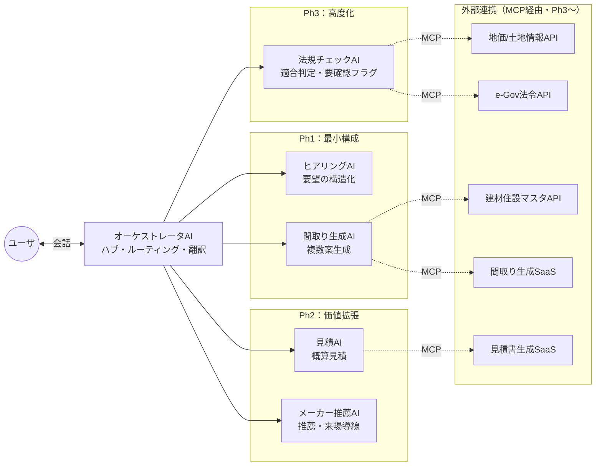
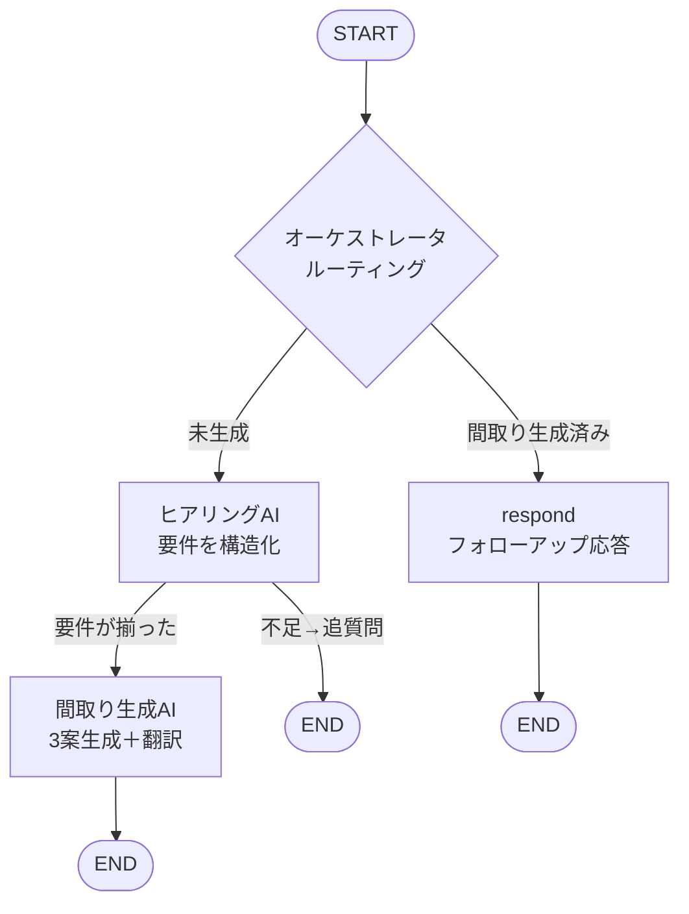
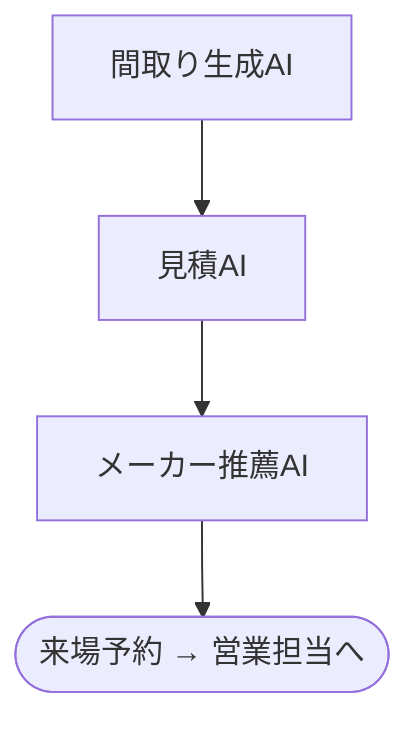

# Sumaiエージェント 要件定義書

- **バージョン**: 0.1.0（Ph1 最小構成）
- **作成日**: 2026-07-14
- **対象範囲**: Ph1（オーケストレータAI + ヒアリングAI + 間取り生成AI）
- **元資料**: `Sumaiエージェントのマルチエージェント方式について .pdf`

---

## 1. 背景・目的

### 1.1 現状の課題
注文住宅の初期検討フェーズでは、購入意欲の高いユーザーが自らハウスメーカーを訪れ、担当者と**数か月かけて**初期プランを作成している。工程は以下の6段階：

1. ヒアリング（要件整理）
2. 初期プラン作成（間取り）
3. 概算見積
4. 法規チェック
5. 商談
6. 詳細設計〜建築

①〜④の初期検討に時間がかかり、ユーザー・メーカー双方の負担が大きい。

### 1.2 Sumaiエージェントが目指す姿
ユーザーの要望から **AIがリアルタイムに初期プラン（①〜④）を作成**し、ハウスメーカーの紹介・来場誘導まで行う。AIは「来場予約まで」を最大化し、そこから先（⑤商談・⑥詳細設計〜建築）は人間の営業担当にバトンタッチする。

### 1.3 スコープの原則
- AIが担うのは **初期検討（①〜④）＋来場誘導** まで。
- 最終的な商談・契約・信頼構築は人間の営業担当が担当。

---

## 2. 全体アーキテクチャ（マルチエージェント）

ユーザーは**オーケストレータAI**とだけ対話し、オーケストレータが各専門エージェントにタスクを振り分け、結果を翻訳して返す。

| エージェント | 役割 | フェーズ |
|---|---|---|
| **オーケストレータAI** | 全エージェントのハブ。会話を解釈しタスクを振り、結果を翻訳して返す | Ph1 |
| **ヒアリングAI** | 要望の深掘り・構造化。「設計に渡せる要件定義」を作成 | Ph1 |
| **間取り生成AI** | 要件＋土地＋法規から間取り案を複数生成 | Ph1 |
| **見積AI** | 間取り＋仕様レベルから概算見積を生成 | Ph2 |
| **メーカー推薦AI** | ハウスメーカーを推薦・理由を言語化・来場予約導線を作る | Ph2 |
| **法規チェックAI** | 外部API連携で法規適合を判定、要人間確認項目をフラグ化 | Ph3 |

### 外部連携（MCP経由・Ph3以降）
- 地価 / 土地情報API
- 建材住設商品マスタAPI
- e-Gov法令API
- 間取り生成SaaS / 見積書生成SaaS 等

### 2.1 アーキテクチャ図（全体・目標像）



### 2.2 Ph1 処理フロー図（実装済み）



---

## 3. Ph1 スコープ定義

### 3.1 実装対象
- オーケストレータAI（ルーティング＋応答翻訳）
- ヒアリングAI（要件の構造化・追質問）
- 間取り生成AI（複数コンセプトの間取り案生成）

### 3.2 Ph1 スコープ外（後続フェーズ）
- 見積AI・メーカー推薦AI（Ph2）
- 法規チェックAI・MCP外部API連携（Ph3）
- 実CAD/図面出力、認証、DB永続化、フロントエンドUI
- 土地情報・法令の外部API自動取得（Ph1ではユーザー入力テキストとして扱う）

---

## 4. 機能要件

### 4.1 オーケストレータAI
| ID | 要件 |
|---|---|
| ORC-1 | ユーザーの発話を受け取り、状態（要件充足度・間取り生成有無）に応じて次エージェントへルーティングする |
| ORC-2 | 要件が未充足なら「ヒアリングAI」へ、充足かつ間取り未生成なら「間取り生成AI」へ振り分ける |
| ORC-3 | 間取り提示後の追加質問・感想には一般応答し、必要に応じて来場相談を提案する |
| ORC-4 | 各エージェントの構造化結果を、ユーザー向けの自然な日本語に翻訳して返す |

### 4.2 ヒアリングAI（Session 2 ①準拠）
| ID | 要件 |
|---|---|
| HEAR-1 | チャットで自然言語の要望を深掘りする |
| HEAR-2 | 会話全体から要望を構造化（要件定義）する。読み取れない項目は推測で埋めない |
| HEAR-3 | 「家族構成・予算・土地情報・希望の広さ」が揃った場合のみ要件充足（`is_complete = true`）と判定する |
| HEAR-4 | 不足項目がある場合、1〜2項目に絞って親しみやすく追質問する |
| HEAR-5 | 生活動線・収納量などの潜在要望も可能な範囲で構造化する |

### 4.3 間取り生成AI（Session 2 ②準拠）
| ID | 要件 |
|---|---|
| PLAN-1 | 要件定義をもとに、**コンセプトの異なる3案**（例: コスパ重視／広さ重視／収納重視）を生成する |
| PLAN-2 | 各案は「延床面積・主要な部屋（広さの目安）・全体説明（動線/採光/階構成）・根拠」を含む |
| PLAN-3 | 予算と広さの整合性、生活動線、採光、収納を考慮する |
| PLAN-4 | 土地情報がある場合は形状・方位の想定を反映する（Ph1では法規の厳密判定は行わない） |

---

## 5. データモデル

### 5.1 RequirementDefinition（要件定義）
ヒアリングAIが作成。各項目は未取得時 `null`。

| 項目 | 型 | 説明 |
|---|---|---|
| `family_structure` | string? | 家族構成 |
| `budget` | string? | 予算 |
| `land_info` | string? | 土地の有無・所在地・広さ・条件 |
| `preferred_design` | string? | 好みのデザイン・テイスト |
| `desired_size` | string? | 希望の広さ・延床面積・部屋数 |
| `lifestyle_flow` | string? | 重視する生活動線 |
| `storage_needs` | string? | 収納の希望 |
| `notes` | string? | その他の要望 |
| `is_complete` | bool | 間取り生成に進める最低限が揃ったか |
| `missing_fields` | string[] | 不足している重要項目 |

**充足条件（`is_complete = true`）**: `family_structure`・`budget`・`land_info`・`desired_size` の4項目が揃っていること。

### 5.2 FloorPlan（間取り案）
| 項目 | 型 | 説明 |
|---|---|---|
| `concept` | string | コンセプト（コスパ重視/広さ重視/収納重視 等） |
| `total_floor_area` | string | 延床面積の目安 |
| `rooms` | Room[] | 主要な部屋の一覧 |
| `layout_description` | string | 間取りの全体説明（動線・採光・階構成） |
| `rationale` | string | ユーザー要望への適合根拠 |

**Room**: `name`（部屋名）, `area`（広さの目安）, `note?`（補足）

---

## 6. 処理フロー

```
START → オーケストレータ ─┬─ respond ───────────────→ END   (間取り提示後のフォローアップ)
                          └─ ヒアリングAI ─┬─ 間取り生成AI → END  (要件が揃った)
                                          └─ END            (追質問した)
```

1. ユーザー発話を受信
2. オーケストレータが分岐：間取り既生成なら `respond`、それ以外は `hearing`
3. ヒアリングAIが会話から要件を構造化・更新
   - 充足 → 間取り生成AIへ
   - 不足 → 追質問して終了
4. 間取り生成AIが3案を生成し、自然言語に翻訳して応答
5. 会話は `session_id`（thread_id）単位で永続化され、複数ターンで継続

---

## 7. API仕様（Ph1）

### `POST /chat`
- **リクエスト**: `{ "session_id": string, "message": string }`
- **レスポンス**:
  ```json
  {
    "reply": "自然言語の応答",
    "requirements": { "...": "...", "is_complete": true, "missing_fields": [] },
    "floor_plans": [ { "concept": "コスパ重視", "rooms": [ ... ] } ],
    "done": true
  }
  ```
- `done` = 間取り案の提示まで完了したか

### `GET /health`
- **レスポンス**: `{ "status": "ok" }`

---

## 8. 非機能要件・技術スタック

| 項目 | 内容 |
|---|---|
| 言語 | Python 3.10+ |
| オーケストレーション | LangGraph（`StateGraph` / `add_messages` / `MemorySaver`） |
| LLM | Claude（Anthropic, 既定 `claude-opus-4-8`）／`langchain-anthropic` |
| API | FastAPI + Uvicorn |
| スキーマ検証 | Pydantic v2（`with_structured_output` による構造化抽出） |
| 会話永続化 | インメモリ `MemorySaver`（Ph1）。DB化はPh2以降 |
| 認証情報 | 環境変数 `ANTHROPIC_API_KEY`（`.env` / 環境変数 / Docker Secret） |
| 配布 | Dockerfile（非rootユーザー、キーは起動時注入） |
| テスト | pytest（LLMモックでルーティング検証） |

### 設定（環境変数）
| 変数 | 既定値 | 説明 |
|---|---|---|
| `ANTHROPIC_API_KEY` | （必須） | Anthropic APIキー |
| `SUMAI_MODEL` | `claude-opus-4-8` | 使用モデル |
| `SUMAI_BASE_URL` | `https://api.anthropic.com` | 接続先。既定は公式API（社内ゲートウェイ設定は継承しない） |
| `SUMAI_TEMPERATURE` | `0.3` | 生成温度（`SUMAI_SEND_TEMPERATURE=true` の時のみ有効） |
| `SUMAI_SEND_TEMPERATURE` | `false` | `claude-opus-4-8` 等は temperature 非対応のため既定で送信しない |

---

## 9. 受け入れ基準（Ph1）

| # | 基準 |
|---|---|
| AC-1 | 要件が不足している発話に対し、ヒアリングAIが追質問を返す（間取りは生成されない） |
| AC-2 | 「家族構成・予算・土地情報・希望の広さ」が揃うと、間取り生成AIが3案を返す |
| AC-3 | 同一 `session_id` で会話が継続し、前ターンの要件が引き継がれる |
| AC-4 | `GET /health` が `{"status":"ok"}` を返す |
| AC-5 | LLMモックによるルーティングテスト（AC-1/AC-2相当）が pytest で通る |

---

## 10. Ph2：価値拡張（見積AI・メーカー推薦AI）

Ph1（要件→間取り）で得た結果を活かし、「無料の概算見積」と「来場予約への誘導」までを担う。

### 10.1 見積AI（Session 2 ③準拠）
**目的**: ユーザーに無料で概算見積を提供する（元は積算担当の業務）。

| ID | 要件 |
|---|---|
| EST-1 | 間取りデータ（面積・部屋構成）から自動で面積・部材量を算出する |
| EST-2 | 仕様（木造/鉄骨、断熱性能など）に応じた概算見積を生成する |
| EST-3 | 複数メーカーの価格帯に合わせた比較表を生成する |
| EST-4 | プレミアムでは仕様詳細を増やして見積精度を上げる（段階的な精緻化） |

**入力**: `FloorPlan` ＋ 仕様レベル（グレード/構造/断熱等）
**出力（想定スキーマ `Estimate`）**: `total_price_range`（概算レンジ）, `breakdown`（項目別: 部材/施工/諸費用）, `spec_level`, `assumptions`（前提）, `maker_comparison`（メーカー別価格帯）

### 10.2 メーカー推薦AI（Session 2 ⑤準拠）
**目的**: AIは「来場予約まで」を最大化し、そこから先は営業担当にバトンタッチする。

| ID | 要件 |
|---|---|
| MKR-1 | 要件・間取り・見積をもとにハウスメーカーを推薦する |
| MKR-2 | 「なぜこのメーカーが合うのか」を言語化する（例:「このメーカーがあなたに合う理由」） |
| MKR-3 | メーカー比較表を生成する |
| MKR-4 | 来場予約への動機付け・導線（プラン説明の事前資料）を作る |
| MKR-5 | 予約完了以降（実商談・契約・信頼構築）は人間の営業担当に引き継ぐ（AIは介入しない） |

**出力（想定スキーマ `MakerRecommendation`）**: `makers`（[{name, fit_reason, price_band, strengths}]）, `comparison_table`, `booking_cta`（来場予約CTA文面）

### 10.3 Ph2 で追加するグラフ経路（想定）


---

## 11. Ph3：高度化（法規チェックAI・外部連携）

### 11.1 法規チェックAI（Session 2 ④準拠）
**方針**: 80%は自動化、20%は人間の最終判断という役割分担とする。

| ID | 要件 |
|---|---|
| LAW-1 | 外部API（用途地域・建ぺい率・容積率・防火地域など）と連携する |
| LAW-2 | 土地座標から法規制を自動取得する |
| LAW-3 | 間取り案が法規に適合しているか自動判定する（斜線制限・日影規制・接道義務・地区計画/条例 等） |
| LAW-4 | 「自動判定できる部分」と「人間が確認すべき部分」を切り分けて出力し、後者をフラグ化して提示する |

**出力（想定スキーマ `LegalCheckResult`）**: `checks`（[{item, status: 適合/不適合/要確認, detail}]）, `auto_judged`（自動判定項目）, `needs_human_review`（要人間確認項目）

### 11.2 MCP 外部連携
オーケストレータおよび各AIが **MCP（Model Context Protocol）経由**で外部リソースにアクセスする。

| 種別 | リソース | 主な利用エージェント |
|---|---|---|
| API | 地価 / 土地情報API | 法規チェックAI・間取り生成AI |
| API | e-Gov法令API | 法規チェックAI |
| API | 建材住設商品マスタAPI | 見積AI・間取り生成AI |
| SaaS | 間取り生成サービス | 間取り生成AI |
| SaaS | 見積書生成サービス | 見積AI |

### 11.3 Ph3 で強化される点
- 間取り生成AI：土地座標＋法規情報を入力に取り込み、法規的に成立しうる間取りを生成
- 法規チェックAI：生成された間取りを検証し、要確認項目を営業担当・設計担当へエスカレーション

---

## 12. 非機能・運用の拡張課題（Ph2以降）

| 項目 | 現状(Ph1) | 拡張方針 |
|---|---|---|
| 会話永続化 | インメモリ `MemorySaver` | DB（PostgreSQL 等）チェックポインタへ置換 |
| 認証・ユーザー管理 | なし | ユーザー認証・セッション管理・利用制限 |
| フロントエンド | 単一HTML | SPA（React等）化、間取り図の視覚表示 |
| 外部連携 | なし（テキスト入力） | MCP サーバ群の導入・レート制御・キャッシュ |
| コスト/可観測性 | ログのみ | トークン使用量計測・トレーシング（LangSmith 等） |
| 品質保証 | ルーティングの単体テスト | 各AI出力の評価（回帰・LLM-as-judge）・E2E自動化 |
